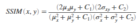

#### ssim_index
- Structural similarity index is an index developed to measure the degree of similarity between two images. The SSIM index can be perceived as a quality measure of one of the images being compared, provided the other image is regarded as of perfect quality. It is an improved version of the universal image quality index proposed before. 
- Detailed description can be read in the following paper:
    - Z. Wang, A. C. Bovik, H. R. Sheikh and E. P. Simoncelli, "Image quality assessment: From error visibility to structural similarity," IEEE Transactions on Image Processing, vol. 13, no. 4, pp. 600-612, Apr. 2004. [Link to paper](https://www.cns.nyu.edu/pub/eero/wang03-reprint.pdf)
  - The derivation of the SSIM index as derived in the paper is as follows:
   
- Package tools
  - math, numpy, torch, cv2
- Results
  - Original vs. Half mixed image: drops to much lower than 0.5
  
  - Original vs. Blurred: drops significantly
  

- References
  - MATLAB code from the above paper by Zhou Wang
  - pytorch-ssim pypi package by Po-Hsun-Su (https://github.com/Po-Hsun-Su/pytorch-ssim)
  - java implementation by Gabriel Prieto Renieblas (https://imagej.nih.gov/ij/plugins/ssim-index.html)